# Ignatian AI Augmentation Agent - User Journey Flowchart

## Complete User Journey Flow

```mermaid
flowchart TD
    Start([User visits app]) --> Landing[Landing Page]
    Landing --> Auth{Google Sign-in}
    Auth -->|Success| Dashboard[User Dashboard]
    Auth -->|Failure| Landing
    
    Dashboard --> IPPStart[IPP Journey Overview]
    IPPStart --> Context[Context Stage]
    
    %% Context Stage (Stage 1)
    Context --> UploadResume[Upload Resume]
    UploadResume --> ResumeCheck{Resume uploaded?}
    ResumeCheck -->|No| UploadResume
    ResumeCheck -->|Yes| UploadJob[Upload Job Description]
    
    UploadJob --> JobCheck{Job description uploaded?}
    JobCheck -->|No| UploadJob
    JobCheck -->|Yes| StartAnalysis[Auto-trigger LLM Analysis]
    
    StartAnalysis --> AnalysisStatus{Analysis Status}
    AnalysisStatus -->|Processing| WaitAnalysis[Show progress indicator]
    WaitAnalysis --> PollStatus[Poll every 3 seconds]
    PollStatus --> AnalysisStatus
    
    AnalysisStatus -->|Failed| AnalysisError[Show error + retry]
    AnalysisError --> StartAnalysis
    
    AnalysisStatus -->|Completed| ShowResults[Display Context Summary]
    ShowResults --> ContextComplete[Mark Context Complete]
    ContextComplete --> Experience[Experience Stage]
    
    %% Experience Stage (Stage 2)
    Experience --> ReviewConnections[Review Document Connections]
    ReviewConnections --> SelectExperiences[Select/Elaborate Experiences]
    SelectExperiences --> VoiceInput{Voice or Text Input}
    VoiceInput -->|Voice| RecordExperience[Record Experience Details]
    VoiceInput -->|Text| TypeExperience[Type Experience Details]
    
    RecordExperience --> ExperienceComplete[Mark Experience Complete]
    TypeExperience --> ExperienceComplete
    ExperienceComplete --> Reflection[Reflection Stage with Sense-Making]
    
    %% Reflection Stage (Stage 3 - includes Sense-Making)
    Reflection --> ShowSynthesis[Show LLM Synthesis & Connections]
    ShowSynthesis --> IdentifyConnections[User Selects Meaningful Connections]
    IdentifyConnections --> IgnatianPrompts[Generate Ignatian Prompts]
    IgnatianPrompts --> DeepReflection[Deep Values-Based Questions]
    DeepReflection --> ReflectionInput{Voice or Text Response}
    ReflectionInput -->|Voice| RecordReflection[Record Reflection]
    ReflectionInput -->|Text| TypeReflection[Type Reflection]
    
    RecordReflection --> ReflectionComplete[Mark Reflection Complete]
    TypeReflection --> ReflectionComplete
    ReflectionComplete --> Action[Action Stage]
    
    %% Action Stage (Stage 4)
    Action --> ProjectGeneration[Generate Portfolio Project Plan]
    ProjectGeneration --> ProjectPlan[Display Actionable Project Steps]
    ProjectPlan --> ReviewProject[User Reviews Project Plan]
    ReviewProject --> ExportProject[Export Project Plan]
    ExportProject --> ActionComplete[Mark Action Complete]
    ActionComplete --> Evaluation[Evaluation Stage]
    
    %% Evaluation Stage (Stage 5)
    Evaluation --> MockInterview[Generate Mock Interview Questions]
    MockInterview --> SelfAssessment[Self-Assessment Framework]
    SelfAssessment --> InterviewPractice[Practice Interview Responses]
    InterviewPractice --> FinalReflection[Final Growth Reflection]
    FinalReflection --> EvaluationComplete[Mark Evaluation Complete]
    EvaluationComplete --> JourneyEnd[IPP Journey Complete]
    
    %% Optional Faculty/Research Features
    Dashboard --> FacultyView{Faculty User?}
    FacultyView -->|Yes| FacultyDashboard[Faculty Dashboard]
    FacultyDashboard --> StudentProgress[View Student Progress]
    FacultyDashboard --> AggregateAnalytics[Aggregate Outcomes]
    
    %% Export and Portfolio Features
    ActionComplete --> PortfolioExport[Portfolio Export Options]
    PortfolioExport --> PDFExport[PDF Export]
    PortfolioExport --> WebExport[Web Portfolio]
    
    %% Data and Research
    EvaluationComplete --> DataCollection[Anonymous Data Collection]
    DataCollection --> ResearchAnalytics[Research Analytics]
    
    %% Multiple Journey Support
    JourneyEnd --> NewJourney{Start New Journey?}
    NewJourney -->|Yes| Context
    NewJourney -->|No| Dashboard

    %% Styling for completed features
    classDef completed fill:#d4edda,stroke:#155724,stroke-width:3px,color:#155724
    classDef inProgress fill:#fff3cd,stroke:#856404,stroke-width:3px,color:#856404
    classDef notStarted fill:#f8d7da,stroke:#721c24,stroke-width:2px,color:#721c24
    
    %% Apply styles to completed features
    class Start,Landing,Auth,Dashboard,IPPStart,Context,UploadResume,ResumeCheck,UploadJob,JobCheck,StartAnalysis,AnalysisStatus,WaitAnalysis,PollStatus,AnalysisError,ShowResults,ContextComplete completed
    
    %% Apply styles to completed Experience stage features
    class Experience,ReviewConnections,SelectExperiences,VoiceInput,RecordExperience,TypeExperience,ExperienceComplete completed
    
    %% Apply styles to not yet started features
    class Reflection,ShowSynthesis,IdentifyConnections,IgnatianPrompts,DeepReflection,ReflectionInput,RecordReflection,TypeReflection,ReflectionComplete,Action,ProjectGeneration,ProjectPlan,ReviewProject,ExportProject,ActionComplete,Evaluation,MockInterview,SelfAssessment,InterviewPractice,FinalReflection,EvaluationComplete,JourneyEnd,FacultyView,FacultyDashboard,StudentProgress,AggregateAnalytics,PortfolioExport,PDFExport,WebExport,DataCollection,ResearchAnalytics,NewJourney notStarted
```



## Development Status Legend

- 🟢 **Completed (Green)**: Fully implemented and tested
- 🟡 **In Progress (Yellow)**: Partially implemented
- 🔴 **Not Started (Red)**: Not yet implemented

## Detailed Development Status

### ✅ COMPLETED FEATURES (Green)

#### 1. Authentication & Core Infrastructure
- **Google OAuth2 Integration**: Complete sign-in flow with Google Identity Services
- **User Management**: User model, JWT tokens, session handling
- **Database Setup**: PostgreSQL with environment-specific schemas (dev/qa/prod)
- **API Foundation**: FastAPI backend with CORS, authentication middleware

#### 2. Context Stage (IPP Stage 1) - COMPLETE
- **Document Upload System**: 
  - Drag-and-drop file upload for resume and job descriptions
  - File validation (PDF, DOC, DOCX, TXT formats)
  - Text extraction from documents
  - File size and type validation
- **LLM Analysis Integration**:
  - OpenAI GPT-4o-mini integration for document analysis
  - Automatic analysis triggering when both documents uploaded
  - Real-time status polling and progress indicators
  - Context summary generation and display
  - Error handling and retry functionality
- **Database Models**: Document and DocumentAnalysis tables with migrations
- **User Interface**: Complete Context stage UI with progress tracking

#### 3. Core System Components
- **Database Migrations**: Alembic setup with schema-aware migrations
- **File Management**: Secure file upload and storage system
- **Environment Configuration**: Multi-environment support with proper secrets management
- **Error Handling**: Comprehensive error handling across frontend and backend

### 🔴 NOT YET STARTED (Red)

#### 1. Reflection Stage (IPP Stage 3) - **Enhanced with Sense-Making**
- **Sense-Making Component**: LLM synthesis of experiences and connections
- **Interactive Connection Identification**: User feedback on meaningful insights  
- **Narrative Construction**: Creating compelling stories from experiences
- **Ignatian Reflection Integration**: Values-based reflection questions
- **Deep Personal Reflection**: Voice/text capture of meaningful insights
- **Pedagogical Integration**: Full Ignatian principles implementation

#### 2. Action Stage (IPP Stage 4)
- Portfolio project plan generation
- Step-by-step project blueprints
- Project export functionality (PDF/Web)
- Interview talking points generation

#### 3. Evaluation Stage (IPP Stage 5)
- Mock interview question generation
- Self-assessment framework
- Interview practice system
- Final growth reflection capture

#### 6. Advanced Features
- **Multi-LLM Architecture**: Specialized LLMs for each IPP stage
- **Faculty Dashboard**: Progress tracking and analytics for educators
- **Research Analytics**: Data collection and outcome measurement
- **Portfolio Export**: Professional portfolio generation
- **Voice Integration**: Speech-to-text throughout the journey
- **Advanced UI/UX**: Enhanced visual design and interactions

## Technical Architecture Summary

### Current Implementation Stack
```
Frontend: React + TypeScript + Tailwind CSS
Backend: FastAPI + Python
Database: PostgreSQL (AWS RDS)
Authentication: Google OAuth2
LLM Integration: OpenAI GPT-4o-mini
File Storage: Local uploads directory
```

### Planned Expansions
```
Multi-LLM: OpenAI GPT-4 + Anthropic Claude
Voice Processing: Speech-to-text integration
Advanced Analytics: User behavior and outcome tracking
Portfolio Generation: PDF/Web export capabilities
Faculty Tools: Educator dashboard and analytics
```

## Next Development Priorities

1. **Experience Stage Implementation** (Next Sprint)
   - Build UI for reviewing analysis results
   - Implement experience selection and elaboration
   - Add voice input capabilities

2. **Multi-LLM Architecture** (Future Sprint)
   - Implement stage-specific LLM orchestration
   - Add Claude integration for reflection stage
   - Build fallback and cost optimization systems

3. **Sense-Making & Reflection Stages** (Future Sprint)
   - Implement narrative synthesis
   - Build Ignatian reflection prompt system
   - Add values-based questioning capabilities

This flowchart shows that we have successfully completed the foundational infrastructure and the entire Context stage of the IPP journey. The system can now handle user authentication, document upload, AI analysis, and provide meaningful insights to users before they progress to the Experience stage.